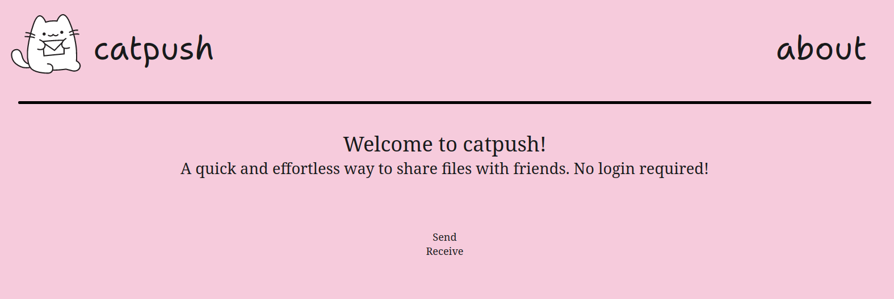
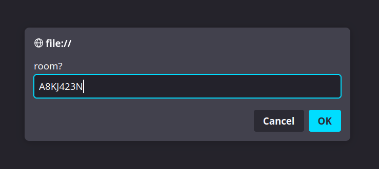
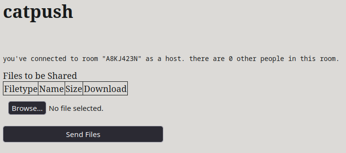
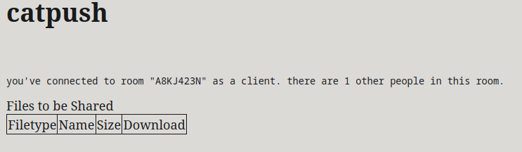
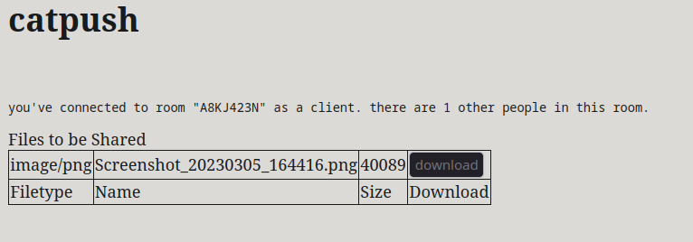

# catpush
A simple, user friendly p2p filesharing service.
Made at Unihack 2023.

# how to set up
1. run `npm install` in the root directory of the project.
2. run `node server.js` in the root directory of the project
3. open index.html

# how to use
1. click the send button on the main page

2. enter the room code you want to use

you'll be sent to this page:

3. open a second instance of `index.html` and select "receive" on the main page
you'll be sent to this page:

4. on the host, select some files. they should appear on the client

5. click "Send File" on the host.
6. the download button on the client should become enabled. click it to download the shared file!
